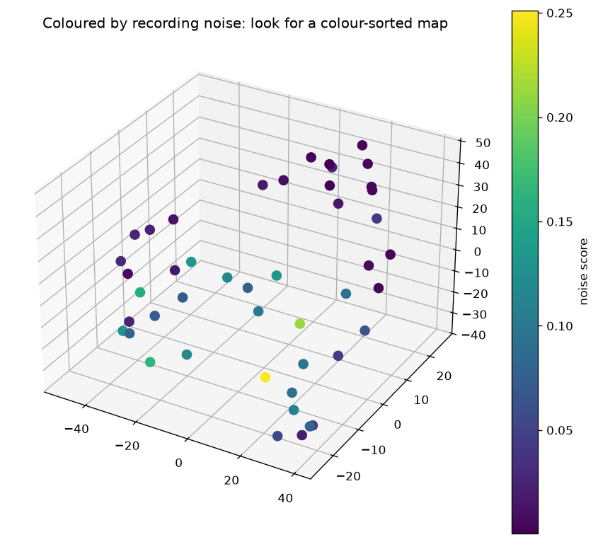

# musicverse

[English](README.md) | [Español](README.es.md)


## What is it?

A 3D map of classical recordings where distance actually means something: two
recordings sit close together if they sound alike.

Each recording goes through an audio embedding model that turns it into a
512-dimensional vector, and those vectors get squeezed down to three dimensions so you
can fly through the result like a star map.

**Where this is right now:** the pipeline works end to end. The 3D frontend doesn't
exist yet. So what's in here is the machinery that builds the map, plus a pile of
measurements I ran to check whether the map means anything, which turned out to be the
most interesting part.

## Why?

You can browse a classical catalogue by composer, by year, or by title. You can't
browse it by how it sounds.

I wanted a place where works sit next to each other by sonic similarity and you could
explore it like a universe: drift into a region, look at what's around you, and run
into things you'd never have searched for by name.

## What I've found so far

The numbers come from a real run over 46 recordings from the Internet Archive's 78rpm
collection. It's a small corpus, so don't take them too literally.

### It maps timbre, not composition

I got lucky here. Two recordings of Debussy's Clair de Lune landed in the corpus: one
by Stokowski with the Philadelphia Orchestra, another by Moura Lympany on solo piano.

They didn't find each other. The closest thing to Stokowski turned out to be Elgar's
Enigma Variations. The closest to Lympany, a Chopin étude played by Cortot. Both at
0.863.

Same piece, opposite corners of the space, split by whatever instrument played it. The
pattern is all over the corpus, a Mozart aria paired with a Rachmaninoff choral piece,
two things with nothing in common except a solo voice over accompaniment.

So this map has regions of piano, of orchestra, of violin, of voice. There's no Debussy
region. Worth knowing before you read too much into a cluster.

### Noisy transfers pile up on each other

Every track carries a `noise_score`, which is spectral flatness: 0 is tonal, 1 is white
noise. Split the corpus at the median and the two halves don't behave the same way
(numbers from the uncentred run, where the scale is easier to read):

| | mean cosine similarity |
|---|---|
| within the noisy half | 0.836 |
| within the clean half | 0.773 |
| across the two halves | 0.752 |

The clean half is barely above the cross-half baseline. The noisy one sits way above
it. So they aren't two symmetric clusters: it's the noisy recordings collapsing onto
each other, which makes sense, because once hiss dominates the spectrum there's less
music left to tell them apart.

All seven acoustic-era Edison discs in the corpus landed in the upper half.



The light dots are the noisy transfers. They bunch up in one region while the clean
ones spread across the whole volume.

### Zero-shot labels didn't work

CLAP puts audio and text in the same space, so in theory you can label a recording by
comparing it against phrases like "a solo piano piece". In practice the winning label
changes depending on how you word the phrase. I tried four phrasings of the same
instrument list. With one of them, 30 of 46 tracks came back as "a full symphony
orchestra", including a solo piano étude by Chopin. A Bach organ prelude got called
piano, orchestra or organ depending on the wording.

The audio vectors hold up fine. What falls apart is the text alignment on
hundred-year-old recordings. I store the score against every label instead of just the
winner, so this can be revisited without re-processing the audio.

### The projection is faithful enough

Trustworthiness measures how much of the 512-dimensional neighbourhood survives the trip
down to 3D. As is, it gives 0.885. Centring the vectors first pushes it to **0.955**.
Same structure, but spread over a wider range of distances, which is easier to preserve
in three dimensions. The ranked list of similar pairs barely changes between the two
versions, which is how I read it: centring stretches the space rather than reorganising
it.

## How it works

```
Internet Archive 78rpm  ->  fetch_audio.py  ->  data/raw/*.mp3
                                                data/manifest.json
                                     |
                                     v
       CLAP embeddings    ->  embed.py     ->  data/embeddings.npz
     (512-d, 10s windows,                      one vector per track
      mean-pooled)                             + noise + label scores
                                     |
                                     v
         UMAP to 3D       ->  project.py   ->  docs/data/universe.json
                                                coordinates, metadata,
                                                precomputed neighbours
                                     |
                                     v
                              frontend (not yet :P)
```

Everything expensive happens offline. The published site is static: it loads one JSON
and draws it. No server, no database.

Two decisions I made:

**No vector database.** At this size it'd be infrastructure for its own sake. Neighbours
get computed offline and travel inside the JSON. That changes if the corpus hits six
figures or if I add live audio search.

**Neighbours come from the 512-dimensional space, not from the 3D picture.** Projections
distort distance past the immediate neighbourhood, so "similar recordings" in the
interface can't be read off the map.

## Layout

```
pipeline/          Python, runs offline
  fetch_audio.py     download from the Internet Archive
  embed.py           audio -> CLAP vectors
  project.py         vectors -> 3D coordinates, plus diagnostics
docs/              the published static site (GitHub Pages serves this folder)
  data/
    universe.json    the map
  img/
    preview.png      the projection, for the README
data/              local working files, outside the repo
  raw/               downloaded audio
  manifest.json      what got downloaded
  embeddings.npz     the vectors
```

Audio never enters the repository. Git handles large binaries badly and keeps them in
history forever.

`docs/` holds the frontend instead of documentation because GitHub Pages only publishes
from the repo root or from a folder with that exact name.

## Running it

Needs Python 3.10+, ffmpeg, and ideally a CUDA GPU for the embedding stage. On CPU it
works, but it takes forever.

```bash
python3 -m venv .venv
source .venv/bin/activate
pip install -r pipeline/requirements.txt

python pipeline/fetch_audio.py --per-composer 5   # download
python pipeline/embed.py                          # embeddings
python pipeline/project.py --center --plot        # projection + diagnostics
```

Every stage skips what it already did, so re-running is cheap. Search results come back
in random order, so running the downloader again adds variety instead of fetching the
same recordings.

`project.py` prints diagnostics instead of just producing a picture. UMAP will always
draw you something. The numbers are what tell you whether it means anything. `--plot`
writes the image you see above to `data/preview.png`.

## Data, and a copyright note

The audio comes from the Internet Archive's 78rpm collection. The metadata there is
uneven in ways that gave me trouble:

- The `creator` field mixes composers and performers without distinguishing them. One
  disc is credited to both Rachmaninoff and Chopin: it's Rachmaninoff playing Chopin. So
  composer attribution here is an artefact of how I searched, not a fact, and I can't
  use it as a label.
- One item is one side of a record, 4 min or so. Longer works end up split across
  several items. A track here doesn't equal a work.

On copyright: under the Music Modernization Act, US recordings published through 1925
are in the public domain, and the line moves forward a year each January. A good part of
the 78rpm collection is more recent than that.

**This repository redistributes no audio.** It holds derived coordinates, metadata and
links back to the original Internet Archive items. Anything downloaded locally stays
local.

The code is MIT. That covers the code only.

## Roadmap (rough)

- [x] Download public-domain recordings, resumable
- [x] CLAP embeddings with a noise score per track
- [x] UMAP projection with quality diagnostics
- [ ] Three.js frontend: fly through it, click a point, see its neighbours
- [ ] Get past 150 recordings so UMAP has more to work with
- [ ] Cross-reference MusicBrainz for real composer and period metadata
- [ ] Colour and filter by noise, so the artefact is visible instead of hidden
- [ ] Play a preview on click, limited to what's clearly in the public domain
- [ ] Melody and harmony from MIDI or automatic transcription. CLAP doesn't represent
      pitch explicitly and more data won't fix that
